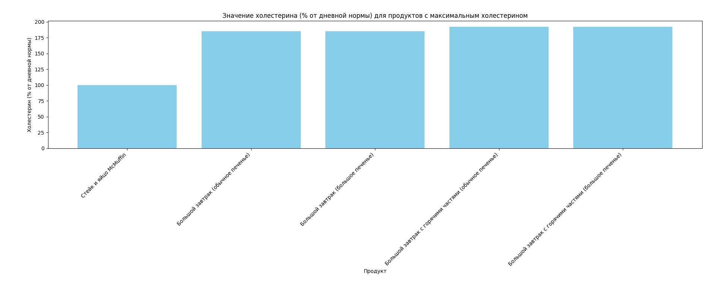
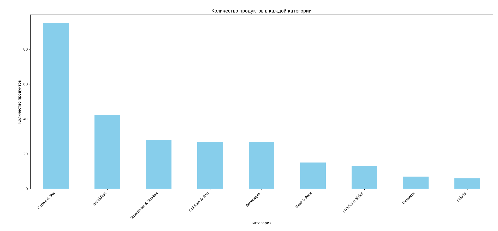

# В данном датасете находятся данные о меню Макдональдс

1. Категория
2. Элемент
3. Размер порции
4. Калории
5. Калории из жира
6. Всего жиров
7. Общее количество жиров (% дневной нормы)
8. Насыщенный жир
9. Насыщенные жиры (% дневной нормы)
10. Трансжиры
11. Холестерин
12. Холестерин (% дневной нормы)
13. Натрий
14. Натрий (% дневной нормы)
15. Углеводы
16. Углеводы (% дневной нормы)
17. Пищевая клетчатка
18.   Пищевая клетчатка (% дневной нормы)
19. Сахара
20. Белок
21. Витамин А (% дневной нормы)
22. Витамин С (% дневной нормы)
23. Кальций (% дневной нормы)
24. Железо (% дневной нормы)

## Гипотеза №1: В Макдональдс присутствют блюда которые превыщают дневную норму холестерина

Следующий график доказывает данную гипотезу, поэтому стоит внимательнее подходит к выбору
продуктов в Макдональдс!

## Гепотиза №2: В меню макдональдс больше всего продуктов в категории "Chicken & Fish" и "Beef & Pork", так как Макдональдс это бургерная

В результате мы получаем информацию, что больше всего продуктов в категории "Кофе чай" - 97  
В категориях "Курица и рыба" и "Говядина и свинина" сумарно - 42